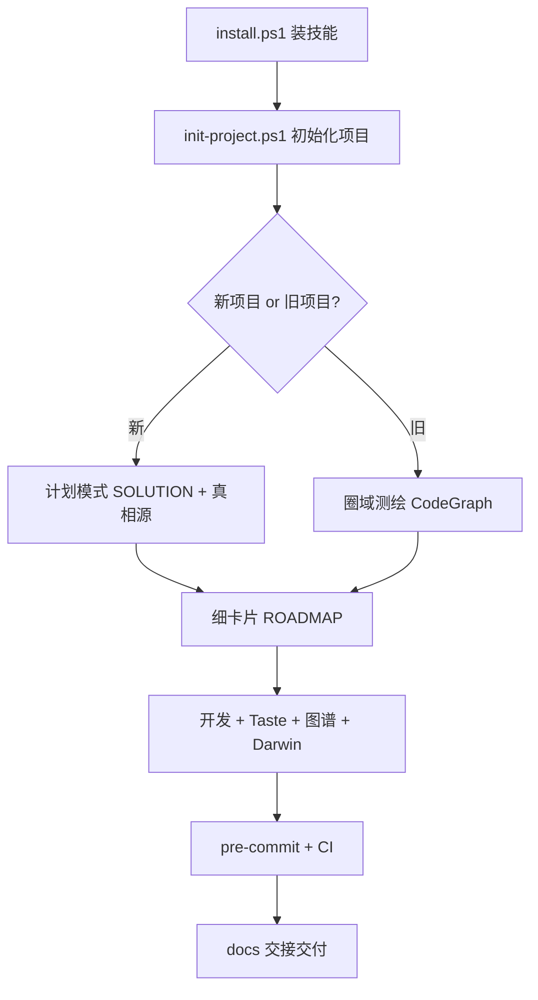

# RingPond 圈域 · 技能包

**RingPond（圈域）** — 把大模型圈进一块精准可控的专业域再执行。  
**语言无关 · 框架无关 · 模型无关 · 新项目与旧项目通用**

> 🏠 **About** → [ABOUT.md](ABOUT.md)  
> 📘 **完整教程（建议精读）** → [TUTORIAL.md](TUTORIAL.md)  
> ⚡ **5 分钟上手** → [QUICKSTART.md](QUICKSTART.md)  
> 📑 **文件索引** → [INDEX.md](INDEX.md)

> 仓库 [github.com/beeshcoo/FishPond](https://github.com/beeshcoo/FishPond)（历史仓库名；技能品牌 **RingPond 圈域**）  
> 兼容触发词：`RingPond` / `圈域` / `FishPond` / `圈鱼塘`

## 流程一览



## 这是什么

符合 **Agent Skills 开放格式** 的技能包。安装到 Claude Code / Cursor 后，说触发词自动加载。

**内嵌三位一体：** Taste（进化设计师）· CodeGraph（知识图谱）· Darwin（技能进化训练）

```
ringpond/                    # 安装目录名（推荐）
├── ABOUT.md                 # 品牌与 About
├── TUTORIAL.md              # 非常详细的完整教程
├── SKILL.md                 # Agent 入口 (name: ringpond)
├── embedded/                # taste · codegraph · darwin
├── solution.md · system-design.md · brownfield.md · …
├── templates/ + docs/ 模板
├── enforcement/             # pre-commit · verify · CI
├── install.ps1 · init-project.ps1 · setup-git.ps1
└── …
```

## 安装

### 步骤 1 · 装技能
```powershell
git clone https://github.com/beeshcoo/FishPond.git
cd FishPond
./install.ps1                 # → ~/.claude/skills/ringpond/
./install.ps1 -Target both    # 同时装 Cursor
```
重启 Claude Code / VS Code。

### 步骤 2 · 初始化项目
```powershell
./init-project.ps1 -Project C:\path\to\项目
./setup-git.ps1 -Project C:\path\to\项目
```
编辑 `.fishpond/verify.ps1` 填入真实构建+测试命令。

## 十一项能力

需求分析 · 系统设计 · 流程图 · 故事地图 · 知识图谱 · docs 交接 · SOP · 新手引导 · Git 版本 · 跨会话记忆 · 规范进化 — 详见 [ABOUT.md](ABOUT.md)。

## 设计原则

- **人拍板，AI 在卡片边界内执行**
- **不臆测 / 真实跑 / 如实报**
- **文档↔代码↔图谱 0 误差**
- **测试不绿不能提交**

> 版本 **v2.1.0** · [CHANGELOG.md](CHANGELOG.md)
