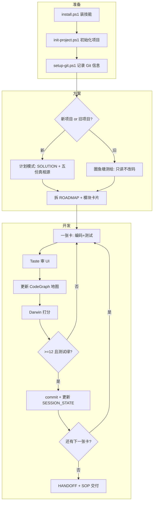

# RingPond 圈域 · 完整教程

> 读完本教程，你能：**安装技能 → 初始化项目 → 新项目/旧项目全流程 → 三位一体协同 → 交接交付**。  
> 品牌：**RingPond 圈域**（别名：FishPond / 圈鱼塘）。语言/框架/数据库 **不限**。

---

# 第一篇 · 认识 RingPond

## 1.1 它是什么、不是什么

**是：**
- 一套「人拍板 + AI 在卡片边界内执行 + 门禁强制验证」的工程方法
- 一套 Agent Skill（`SKILL.md` + 流程文件 + 模板 + 钩子）
- 项目的「外置大脑」：`.fishpond/` + `docs/`

**不是：**
- 自动写完整个系统的魔法
- 保证零 bug 的承诺
- 绑定 Java/React/PostgreSQL 的专用工具

## 1.2 三个核心动作（永远记住）

```
① 说触发词，让技能加载
② 计划模式里和人敲定文档（架构/功能/数据/接口/地图）
③ 一张模块卡片一张卡片地开发，测试不绿不能提交
```

## 1.3 一张图看懂全流程



---

# 第二篇 · 安装与初始化

## 2.1 环境要求

- **Git**（项目必须是 git 仓库）
- **Claude Code**（VS Code 插件）或 **Cursor**
- 可选：**PowerShell 7+**（Windows 跑 `verify.ps1`）
- 可选：**GitHub Actions**（CI 第二道门禁）

## 2.2 安装技能（装到 AI 工具，一次即可）

```powershell
git clone https://github.com/beeshcoo/FishPond.git
cd FishPond
./install.ps1              # 默认装进 Claude Code: ~/.claude/skills/ringpond/
./install.ps1 -Target both # 同时装 Cursor
```

**重启 VS Code / Claude Code**（必须，否则扫不到新技能）。

### 验证安装成功

新开对话，输入：
```
用 RingPond 圈域帮我看下，今天怎么开始？
```
若 AI 提到计划模式、模块卡片、`.fishpond/`、三位一体等，说明技能已加载。

> 兼容触发词：`RingPond` / `圈域` / `FishPond` / `圈鱼塘`

## 2.3 初始化你的项目（每个项目一次）

```powershell
cd C:\path\to\你的项目
C:\path\to\FishPond\init-project.ps1 -Project .
C:\path\to\FishPond\setup-git.ps1 -Project .
```

### init-project 会创建什么

**`.fishpond/`（20+ 文件）**  
PROJECT_PROFILE · ARCHITECTURE · FEATURE_LIST · UI_UX · DATA_MODEL · API_SPEC  
STORY_MAP · SYSTEM_GRAPH · FLOW_ARCHITECTURE · NAVIGATION · ROADMAP · TRACEABILITY  
TASTE_PROFILE · DARWIN_SCORES · EVOLUTION · SESSION_STATE · GIT_PROFILE  
HANDOFF · DEVLOG · LESSONS · CHANGELOG · cards/ · verify.ps1

**`docs/`**  
SOLUTION · SOP · ONBOARDING · ENGINEERING_CHARTER · HANDOFF/README.md

**`.githooks/pre-commit`**  
测试不绿 → 无法 commit

### 2.4 配置 verify.ps1（最关键一步）

编辑 `.fishpond/verify.ps1`，把 TODO 换成**你项目真实且已亲测**的命令：

```powershell
# 示例：Java 后端 + 前端 monorepo
Invoke-Step "1/2 build" 'cd services\server; .\mvnw.cmd -q compile'
Invoke-Step "2/2 test"  'cd services\server; .\mvnw.cmd -q test'
```

**亲测：**
```powershell
powershell -File .fishpond\verify.ps1
echo $LASTEXITCODE   # 必须是 0
```

### 2.5 配置 CI（推荐）

```powershell
mkdir .github\workflows -Force
copy C:\path\to\FishPond\enforcement\ci.example.yml .github\workflows\ci.yml
```

GitHub → Settings → Branches → 保护 main → 勾选 **Require status checks** → 选 `verify`。

---

# 第三篇 · 触发词与模式路由

## 3.1 说什么话 → 走什么流程

| 场景 | 你对 AI 说 |
|---|---|
| 新项目从零 | `用 RingPond 圈域做一个 XX 系统，先计划模式，确认方案后再写代码` |
| 完整方案 | `用 RingPond 出完整系统方案，写入 docs/SOLUTION 和 .fishpond/` |
| 旧项目接手 | `用 RingPond 接手这个已有项目，先只圈鱼塘测绘，禁止改业务代码` |
| 旧项目拆细块 | `我这轮只改 XX 模块，拆成非常细的卡片清单，先给清单别写代码` |
| 开发单模块 | `用 RingPond 开发 XX 模块，先写模块卡片给我确认` |
| 审查 | `用 RingPond 审查 XX 模块` |
| UI 审查 | `用 RingPond Taste 审查这个页面的 UI` |
| 更新图谱 | `用 RingPond 更新 SYSTEM_GRAPH 和 STORY_MAP` |
| 打分进化 | `用 RingPond Darwin 给这次交付打分并写 EVOLUTION` |
| 线上故障 | `线上 XX 出问题，用 RingPond 帮我排查` |

## 3.2 任务分级（别小事大作）

| 级别 | 条件 | 怎么做 |
|---|---|---|
| 🟢 微改动 | 改文案/常量/明显 typo，不动接口和表 | 直接改 + 跑相关测试 + 说明 |
| 🟡 单模块 | 新增或改造一个模块 | 完整 dev 流程 + 一张卡片 |
| 🔴 跨模块 | 改公共接口/数据结构/多模块 | 人确认边界 → 拆多张卡 → 逐张跑 |

---

# 第四篇 · 新项目完整演练

以「报销审批系统」为例。

## 4.1 计划模式（只讨论，不写码）

**你说：**
```
用 RingPond 圈域做一个报销审批系统。先进入计划模式，和我聊需求。
```

**AI 应问你：** 目标用户、核心场景、边界、非功能要求、技术约束。

**你要做：** 如实回答；含糊处要求它追问；**不确认就不让它写代码**。

## 4.2 产出五份真相源 + 方案总册

确认后 AI 应写入：

| 文件 | 内容 |
|---|---|
| `docs/SOLUTION.md` | 给人审的完整方案总览 |
| `.fishpond/ARCHITECTURE.md` | 子域、模块、依赖、ADR |
| `.fishpond/FEATURE_LIST.md` | F-001, F-002… |
| `.fishpond/UI_UX.md` | 页面、交互、7 态 |
| `.fishpond/DATA_MODEL.md` | 表、字段、约束 |
| `.fishpond/API_SPEC.md` | 接口、错误码、鉴权 |
| `.fishpond/STORY_MAP.md` | 用户故事 ST-xxx |
| `.fishpond/SYSTEM_GRAPH.md` | 知识图谱骨架 |
| `.fishpond/FLOW_ARCHITECTURE.md` | 主/支撑/分支/异常流程图 |

**你审核：** 逐份看，不满意就改，**签字后才进入开发**。

## 4.3 拆卡片路线图

**你说：**
```
把功能清单拆成有序的模块卡片 ROADMAP，被依赖的排前面，给我确认。
```

**你确认：** 顺序、范围、每张卡是否「只做一件事、能独立测试」。

## 4.4 逐卡开发（循环）

对每一张卡：

**你说：**
```
开始做 cards/user-auth.md 这张卡。
要求：一次只改这张卡范围；Taste 审 UI；更新 SYSTEM_GRAPH；
Darwin 打分；更新 SESSION_STATE。
```

**AI 应做：**
1. 按顺序写：迁移 → 模型 → 仓库 → DTO → 服务 → 接口（前端：组件 → hook → API）
2. 代码入口留 `// [F-001]` 锚点
3. 真实跑测试，**贴命令和原始输出**
4. 同步 FEATURE_LIST / DATA_MODEL / API_SPEC / NAVIGATION / SYSTEM_GRAPH
5. Taste 审查 UI（若有）
6. Darwin 打分写入 DARWIN_SCORES；低分写 EVOLUTION
7. 更新 SESSION_STATE、DEVLOG
8. commit（pre-commit 自动跑 verify）

**你把关：**
- 有没有贴真实测试输出？
- 有没有越界改其他模块？
- 图谱和代码是否一致？
- Darwin 是否 <12 还开下一张？（不许）

## 4.5 交付

**你说：**
```
生成交接包：HANDOFF 填实、docs/SOP、Darwin 总结、找没参与的人能跑通。
```

---

# 第五篇 · 旧项目（棕地）完整演练

## 5.1 四步话术（按顺序复制）

### ① 测绘（禁止改业务代码）
```
用 RingPond 接手这个已有项目。先只做圈鱼塘：
1) 完善 PROJECT_PROFILE（构建/测试命令先真跑）
2) 增量完善 ARCHITECTURE、FEATURE_LIST、DATA_MODEL、API_SPEC、NAVIGATION
3) 新建 STORY_MAP + SYSTEM_GRAPH 骨架
禁止修改任何业务代码，完成后给我看。
```

### ② 圈小范围拆细卡
```
我这轮只改「组织中心+审批中心」。拆成非常细的模块卡片写入 ROADMAP，
标注现有代码位置（引用 NAVIGATION），先给清单别写代码。
```

### ③ 表征测试锁现状
```
动第一张卡前，给涉及的现有功能补 characterization test，跑绿后再改。
```

### ④ 绞杀者模式逐卡替换
```
做第一张卡：只改卡内文件；新逻辑走新路径；改完真跑测试贴输出；
更新 SYSTEM_GRAPH、SESSION_STATE、DEVLOG。
```

详见 [brownfield.md](brownfield.md)。

---

# 第六篇 · 三位一体实操

## 6.1 Taste · 设计师如何「越来越强」

**何时触发：** 任何 UI 页面/组件交付前。

**流程：**
1. 读 `TASTE_PROFILE.md` 已有规则
2. 对照 `UI_UX.md` 规格
3. 过 Taste 审查清单（7 态、token、无假成功…）
4. 有问题 → 改代码 → 在 TASTE_PROFILE **追加新规则**

**示例进化：**
```
问题：审批列表 Badge 样式不统一、难看
→ TASTE_PROFILE 新增规则：「状态 Badge 必须用 .slp-status-badge，禁止 inline style」
→ 下次 AI 自动遵守
```

## 6.2 CodeGraph · 地图如何「秒级定位」

**两张地图：**
- `STORY_MAP.md` — 业务视角（谁要什么、走什么流）
- `SYSTEM_GRAPH.md` — 技术视角（谁调谁、谁读写哪张表）

**每次改接口/表/模块后：**
1. 在 SYSTEM_GRAPH 补节点/边
2. 在 STORY_MAP 更新故事↔技术映射
3. 在 NAVIGATION 补扁平索引

**定位示例：**
```
问：ORDER_ITEMS_EMPTY 报错改哪？
→ NAVIGATION 错误码表 → OrderService.create:42
→ SYSTEM_GRAPH 看谁 calls/writes TBL-order
```

## 6.3 Darwin · 技能如何「训练变强」

**每次收工：**
1. 按 Rubric 10 维度各 0–2 分（满分 20）
2. 写入 `DARWIN_SCORES.md`
3. 若 <12：不许下一张卡；写 `EVOLUTION.md` 补丁
4. 补丁落实到：`ENGINEERING_CHARTER` / `TASTE_PROFILE` / 审查清单

**示例：**
```
得分 10/20，低分 #4 图谱 #7 交接
→ EVOLUTION：「每张卡 commit 前 diff SYSTEM_GRAPH」
→ ENGINEERING_CHARTER 新增 P-003 条目
→ 下次开工 SESSION_STATE 提醒先 diff 图谱
```

---

# 第七篇 · 记忆、Git、规范

## 7.1 关电脑再开（SESSION_STATE）

**每次收工 AI 必须更新** `.fishpond/SESSION_STATE.md`：
- 当前卡片、进度、下一步、未决问题、最近测试结果

**下次开工 AI 必须先读** SESSION_STATE → 不用你重复背景。

## 7.2 Git 版本（GIT_PROFILE）

`setup-git.ps1` 记录：远程地址、分支、git 用户名/邮箱（**无 token**）。

每次 push 在 GIT_PROFILE 的 Push 记录表追加一行，关联 DEVLOG。

回滚：`git revert <hash>`，禁止 `reset --hard`。

## 7.3 工程规范进化（ENGINEERING_CHARTER）

`docs/ENGINEERING_CHARTER.md` = 项目铁律 + Darwin 进化区。

每次 EVOLUTION 补丁 → 追加 P-xxx 条目 →  stupid 错误不再发生。

---

# 第八篇 · docs 交接体系

## 8.1 两套 HANDOFF 分工

| 文件 | 粒度 | 给谁 |
|---|---|---|
| `.fishpond/HANDOFF.md` | 逐步命令：怎么 clone、安装、跑测试 | 新人第一天 |
| `docs/HANDOFF/README.md` | 总册索引：读哪些文档、出问题查哪 | 交接负责人 |

## 8.2 其他 docs

- `docs/SOLUTION.md` — 方案总览（给业务/技术负责人审）
- `docs/SOP.md` — 上线/回滚/监控
- `docs/ONBOARDING.md` — 产品内新手引导规格（前端按此实现）

**原则：** docs 与 `.fishpond/` 和代码 **0 误差**；不符 = 缺陷。

---

# 第九篇 · 在本项目做实验（software-lifecycle-platform）

已 init v2 骨架。建议实验顺序：

```
阶段 A：测绘组织中心+审批中心 → STORY_MAP + SYSTEM_GRAPH 骨架
阶段 B：REQ-0014 相关拆细卡 → ROADMAP
阶段 C：第一张卡端到端 + Taste + Darwin + 全绿测试
```

实验清单见 [EXPERIMENT.slp.md](EXPERIMENT.slp.md)。

**对 AI 说（阶段 A）：**
```
用 RingPond 圈域接手 software-lifecycle-platform。
先只测绘组织中心与审批中心，完善 STORY_MAP 和 SYSTEM_GRAPH，
引用现有 NAVIGATION 和 cards/。禁止改业务代码。
```

---

# 第十篇 · DeepSeek / 弱模型专用纪律

1. **一次只喂一张卡** — 上下文越窄越不胡说
2. **每次要真实输出** — 「通过了」→「贴出刚运行的命令和 exit code」
3. **拿不准就停** — 表结构/契约/架构没写清就问人
4. **门禁是最后防线** — 它想跳过验证，pre-commit 也会拦

---

# 第十一篇 · FAQ

**Q：RingPond 和 FishPond 什么关系？**  
A：FishPond 是早期代号；RingPond 圈域是 v2 正式品牌，能力完全包含 FishPond。

**Q：必须装 CI 吗？**  
A：不必须，但强烈建议。只有 pre-commit 拦本地；CI 拦 PR。

**Q：.fishpond/ 要提交 git 吗？**  
A：要。它是团队共识和 AI 记忆，别写 token 即可。

**Q：微改动也要写卡片吗？**  
A：不用。🟢 微改动直接改+跑测试。

**Q：图谱太大维护不动？**  
A：按子域分章节；每张卡只更新本卡相关节点；不要攒到最后。

---

# 附录 · 速查命令

```powershell
# 装技能
./install.ps1

# 初始化项目
./init-project.ps1 -Project C:\path\to\proj
./setup-git.ps1 -Project C:\path\to\proj

# 跑门禁
powershell -File .fishpond\verify.ps1

# 紧急跳过（清楚后果）
$env:FISHPOND_SKIP=1; git commit -m "..."
```

---

**下一步：** 读 [ABOUT.md](ABOUT.md) 了解品牌与边界 · 用 [QUICKSTART.md](QUICKSTART.md) 5 分钟上手 · 用 [INDEX.md](INDEX.md) 查文件
