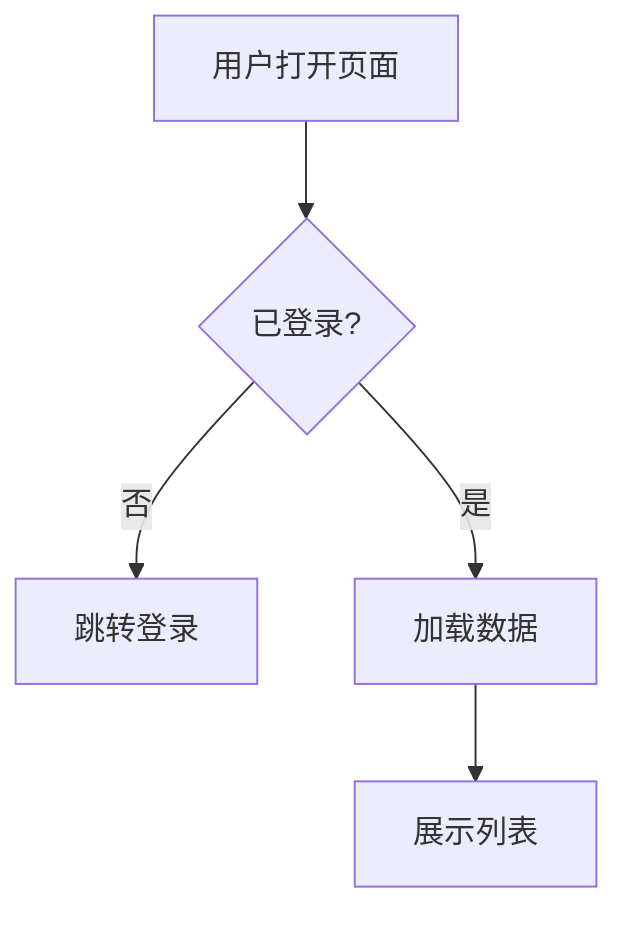
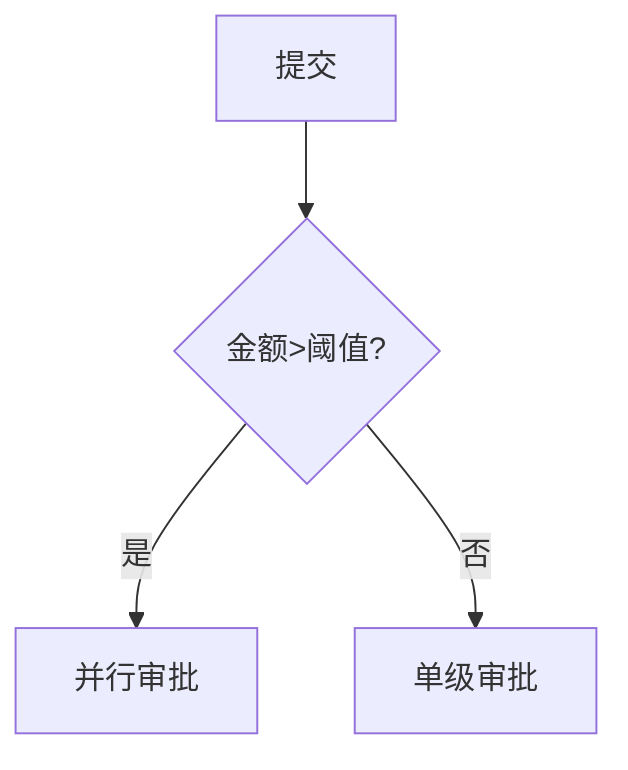
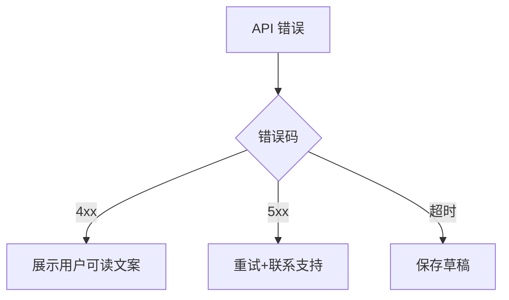

# 流程架构 (Flow Architecture)

> `.fishpond/FLOW_ARCHITECTURE.md` — 主/支撑/分支/异常四类流；mermaid 源可导入 Visio/draw.io。
> 与 STORY_MAP 故事 ID 互链。

---

## <业务能力名> · 主流程
**关联故事**：ST-001, ST-002

## <业务能力名> · 支撑流（鉴权/通知/审计）

## <业务能力名> · 分支流

## <业务能力名> · 异常流

## 流程 ↔ 技术映射
| 流程节点 | API | 表 | 页面 |
|---|---|---|---|
| 加载数据 | GET /api/v1/xxx | tbl_xxx | PG-list |
