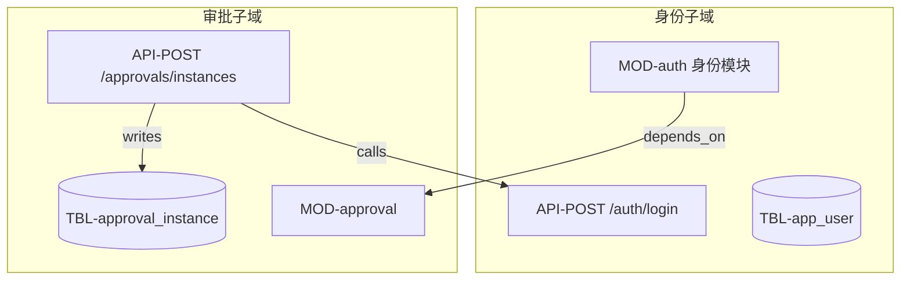
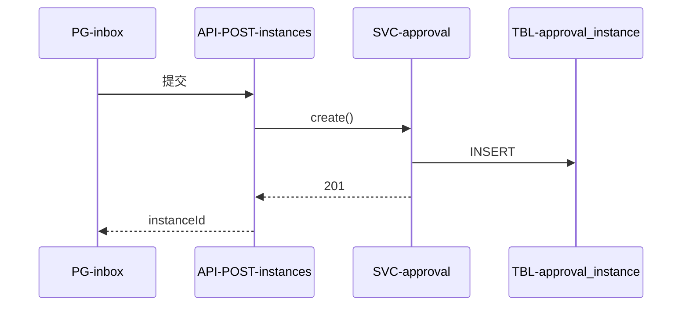

# 系统知识图谱 (System Graph / CodeGraph)

> `.fishpond/SYSTEM_GRAPH.md` — 模块/服务/API/表/字段/中间件/页面的**关系网络**。
> 详见 [embedded/codegraph.md](../embedded/codegraph.md)。变更必同步 NAVIGATION + STORY_MAP。

## 1. 子域总览

## 2. 主流程 · 序列图（示例：提交审批）

## 3. 节点索引
| ID | 类型 | 名称 | 位置/路径 | 故事 | 代码(NAVIGATION) |
|---|---|---|---|---|---|
| MOD-auth | 模块 | 身份 | src/identity/ | ST-001 | identity/AccountController |
| API-POST-auth-login | API | 登录 | POST /api/v1/auth/login | ST-001 | |
| TBL-app_user | 表 | 用户 | DATA_MODEL §app_user | ST-001 | V3__create_app_user |
| MW-postgres | 中间件 | PostgreSQL | compose postgres | - | |
| PG-login | 页面 | 登录页 | /login | ST-001 | LoginView.tsx |

## 4. 边索引
| From | To | 关系 | 说明 |
|---|---|---|---|
| API-POST-instances | MOD-auth | depends_on | 需鉴权 |
| SVC-approval | TBL-approval_instance | writes | 创建实例 |
| PG-inbox | API-GET-tasks | calls | 拉待办 |

## 5. 秒级定位
- 改 **ST-001** → 故事地图 → 本表节点 → NAVIGATION 代码列
- 改 **TBL-app_user** → 边索引看谁 reads/writes → 影响分析 → 全量回归

## 变更记录
| 日期 | 变更 | 影响节点 |
|---|---|---|
