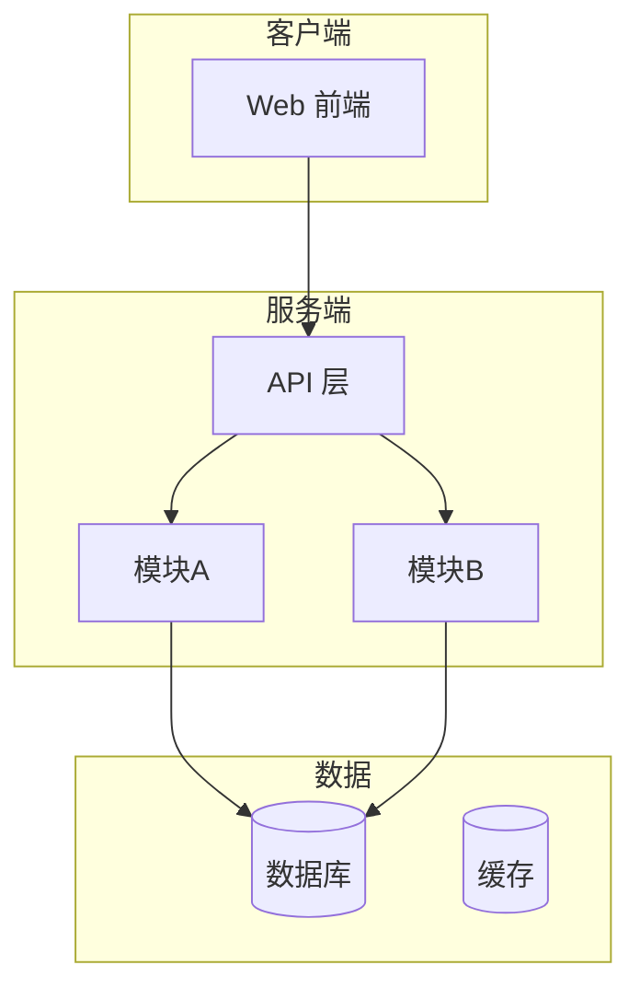

# 需求分析与系统方案 (Solution)

> `docs/SOLUTION.md` — 需求 #1 产出：完整系统方案，人确认后开发。

## 1. 需求摘要
- **项目名称**：
- **目标用户**：
- **核心问题**：
- **边界（不做）**：

## 2. 方案总览（一张图）

## 3. 子域划分
| 子域 | 职责 | 模块 | 详见 |
|---|---|---|---|
| | | | ARCHITECTURE.md |

## 4. 功能方案摘要
→ 详见 `.fishpond/FEATURE_LIST.md`（F-xxx 清单）

## 5. UI/UX 方案摘要
→ 详见 `.fishpond/UI_UX.md` + `TASTE_PROFILE.md`

## 6. 数据方案摘要
→ 详见 `.fishpond/DATA_MODEL.md`（表/字段级）

## 7. 接口方案摘要
→ 详见 `.fishpond/API_SPEC.md`

## 8. 流程与故事地图
→ `.fishpond/FLOW_ARCHITECTURE.md` + `STORY_MAP.md`

## 9. 系统图谱
→ `.fishpond/SYSTEM_GRAPH.md`

## 10. 非功能方案
| 项 | 目标 | 策略 |
|---|---|---|
| 性能 | | |
| 安全 | | |
| 可用 | | |

## 11. 技术选型 ADR 摘要
| 决策 | 理由 | 状态 |
|---|---|---|

## 12. 确认签字
- [ ] 业务确认  日期：____  确认人：____
- [ ] 技术确认  日期：____  确认人：____

**签字前禁止写业务代码。**
